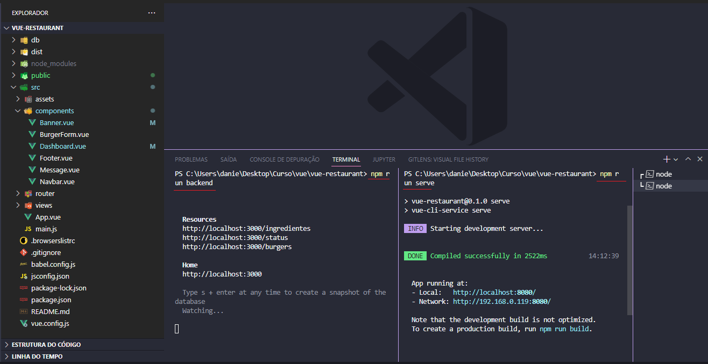

# vue-restaurant

I made the site using vue.js and a database simulated by a JSON in the db folder. The commercial objective of the website is to simulate a restaurant where the customer personalizes his hambuger order.

On this site I used my knowledge of how to reuse components, how to make a CRUD for hamburger orders.

I learned how to use methods, props, mounted, click events, loops, forms, ...

<hr>
### Project start front end in local host
```
npm run serve
```

### Start the backend project on localhost, the database is JSON saved in the db folder.
```
npm run backend
```
 


<hr>
### And the final result you can check in the image below or by <a src="https://ponja94.github.io/vue-restaurant/">clicking here!</a>


